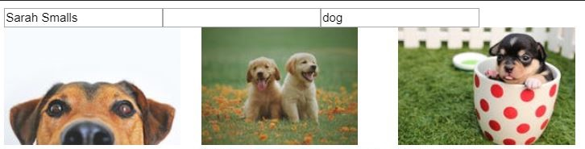

# LAB - 

## Project: soket-fetch

### Author: Meron

### Links and Resources
* [submission PR](https://github.com/meron-401n14/lab-23/pull/2)
* [codesandbox](https://codesandbox.io/s/cranky-shaw-u0977)
* [travis](https://lxyz.com/)

#### Documentation
* [jsdoc](comments only)
* [styleguide](https://github.com/shri/JSDoc-Style-Guide#functions)

### Modules
* useLocalSotorage
* usePexelPhotos
* useDocumentTitle

### Setup

* current status of this app
* 
#### `.env` requirements
* `PORT` - 3000

* `Authorization`:563492ad6f9170000100000130c44fce1766475e80aef145359fa641

#### Running the app
* `npm start`

  
#### Tests

#### UML
Link to an image of the UML for your application and response to events