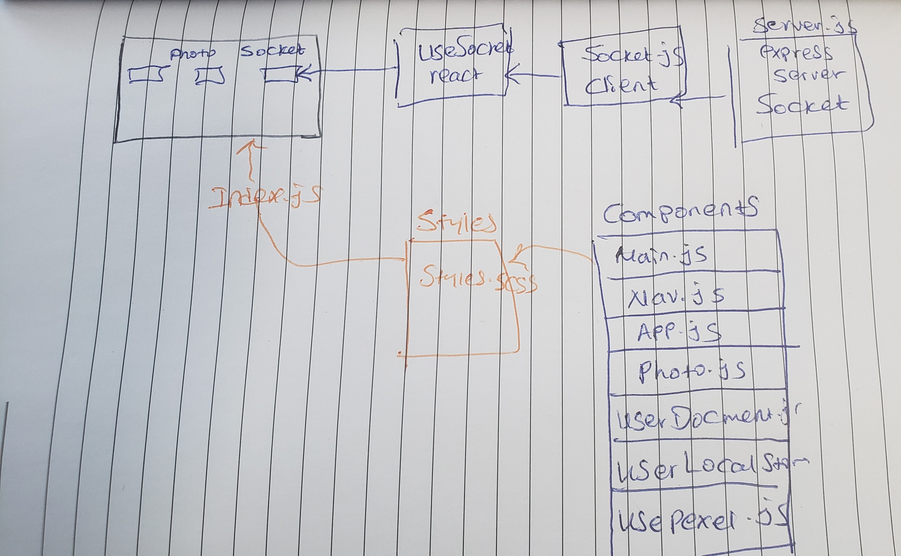

# LAB - 23

## Project: soket-fetch

### Author: Meron

### Links and Resources
* [submission PR](https://github.com/meron-401n14/lab-23/pull/1)
* codesandbox](https://codesandbox.io/s/cranky-shaw-u0977)
* [travis](https://lxyz.com/)

#### Documentation
* [jsdoc](comments only)
* [styleguide](https://github.com/shri/JSDoc-Style-Guide#functions)

### Modules
* useLocalSotorage
* usePexelPhotos
* useDocumentTitle
* main.js
* Photo.js
* Nav.js
* Socket.js

### Setup
// to run socket server
* Socket.io server is  `cd server.js `
* to start socket server use 
* `node start`  // localhost:3005 

#### UML
* 

